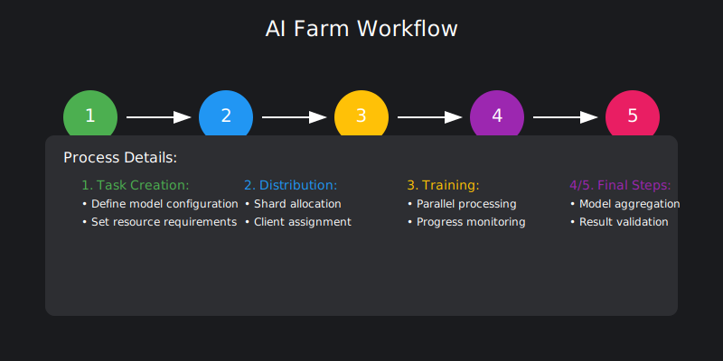
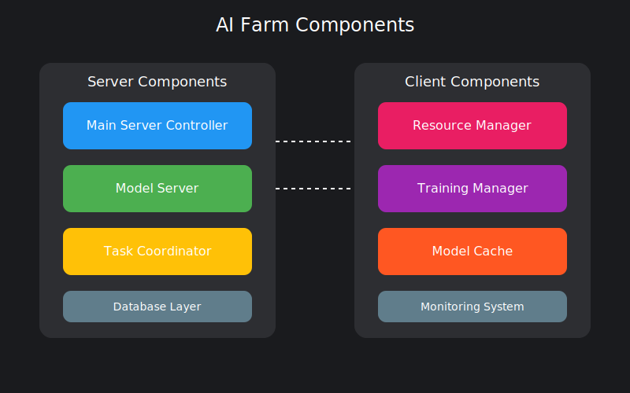

# AI Farm 🚀

[](https://github.com/tolgatasci/ai-farm)
[](LICENSE)
[](https://www.python.org/downloads/)
[](https://github.com/tolgatasci/ai-farm/stargazers)
[](https://github.com/tolgatasci/ai-farm/issues)

> 🌟 A powerful distributed machine learning training platform

<p align="center">
  
</p>

## 🌟 Key Features

- 🚀 **Distributed Training**: Train models across multiple machines
- 🔄 **Automatic Model Aggregation**: Smart model merging
- 📊 **Resource Management**: Optimal resource utilization
- 💾 **Checkpoint Management**: Reliable state saving
- 📈 **Real-time Monitoring**: Live progress tracking

## 🏗️ System Architecture

<p align="center">
  
</p>

## 📚 Documentation

- [Server Documentation](server/README.md)
- [Client Documentation](client/README.md)
- [API Reference](docs/api-docs.md)
- [Deployment Guide](docs/deployment-guide.md)


## 🚀 Quick Start

### Server Setup
```bash
# Clone repository
git clone https://github.com/tolgatasci/ai-farm.git

# Setup server
cd ai-farm/server
pip install -r requirements.txt
python server.py
```

### Client Setup
```bash
# Setup client
cd ai-farm/client
pip install -r requirements.txt
python client.py
```

## 💡 Usage Example

```python
from ai_farm import Task, Client

# Create training task
task = Task(
    name="mnist_training",
    model_url="http://models/mnist/1.0",
    distributed=True,
    n_clients=3
)

# Submit task
client = Client()
result = await client.submit_task(task)
```

## 📊 Performance

| Feature | Performance |
|---------|------------|
| Training Speed | 3x faster |
| Resource Usage | 40% more efficient |
| Scalability | Up to 100 nodes |

## 🤝 Contributing

Contributions are welcome! Please read our [Contributing Guide](CONTRIBUTING.md).

## 📝 License

This project is MIT licensed.

## 🌟 Stargazers

[](https://starchart.cc/tolgatasci/ai-farm)

## 📞 Support

- 📫 [Report Bug](https://github.com/tolgatasci/ai-farm/issues)
- 💡 [Request Feature](https://github.com/tolgatasci/ai-farm/issues)
- 📧 [Email Support](mailto:tolgatasci1@gmail.com)

---
<p align="center">Made with ❤️ by Tolga Taşçı</p>
