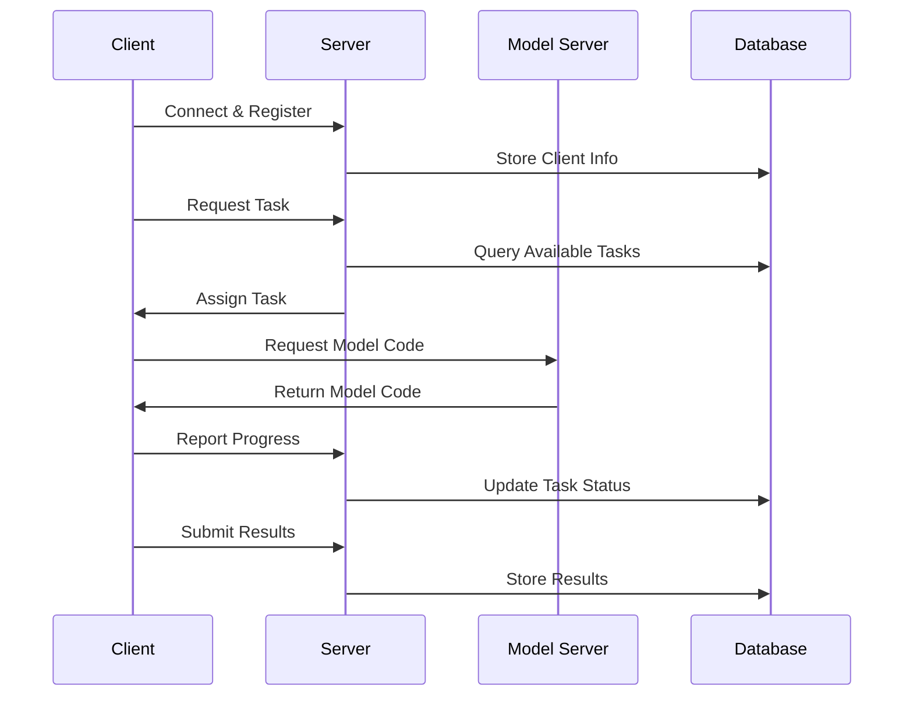
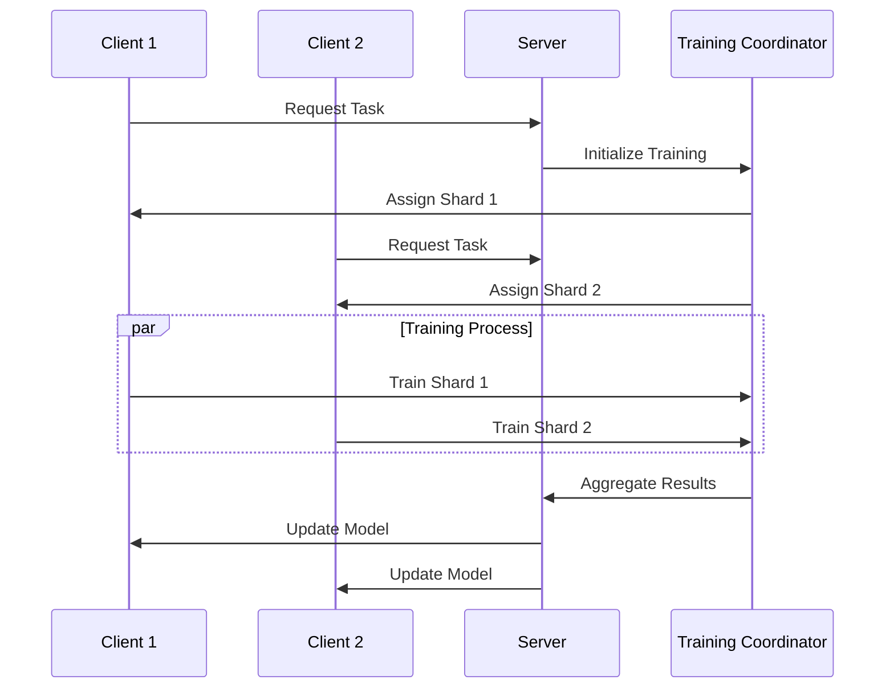

# AI Farm System Architecture and Workflow

## System Components Overview

### High-Level Architecture
```
AI Farm System
├── Server Layer
│   ├── Main Server (WebSocket + HTTP)
│   ├── Model Server
│   └── Database Server
├── Client Layer
│   ├── Resource Manager
│   ├── Training Manager
│   └── Model Cache
└── Infrastructure Layer
    ├── Load Balancer
    ├── Message Queue
    └── Storage System
```

## Communication Flows

### 1. Task Distribution Flow


### 2. Distributed Training Flow


## Component Details

### 1. Server Components

#### Main Server
```python
class AIFarmServer:
    def __init__(self):
        self.clients = {}
        self.tasks = {}
        self.coordinators = {}
        
    async def handle_client(self, websocket, path):
        """Main client handler"""
        try:
            # Client registration
            client_info = await self.register_client(websocket)
            
            # Message handling loop
            while True:
                message = await websocket.recv()
                await self.process_message(message, client_info)
                
        except websockets.ConnectionClosed:
            await self.handle_disconnect(client_info)
            
    async def process_message(self, message, client_info):
        """Message router"""
        handlers = {
            'task_request': self.handle_task_request,
            'progress_update': self.handle_progress,
            'result_submit': self.handle_result
        }
        
        msg_type = message.get('type')
        if msg_type in handlers:
            await handlers[msg_type](message, client_info)
```

#### Load Balancer
```python
class LoadBalancer:
    def __init__(self):
        self.resource_tracker = ResourceTracker()
        self.task_queue = PriorityQueue()
        
    async def assign_task(self, clients: List[Client]) -> Dict:
        """Assign tasks based on resource availability"""
        available_clients = self.filter_eligible_clients(clients)
        if not available_clients:
            return None
            
        task = await self.task_queue.get_next()
        if not task:
            return None
            
        best_client = self.select_optimal_client(
            available_clients, 
            task.requirements
        )
        
        return {
            'client': best_client,
            'task': task
        }
        
    def select_optimal_client(
        self, 
        clients: List[Client], 
        requirements: Dict
    ) -> Client:
        """Select best client based on resources and performance"""
        scores = []
        for client in clients:
            score = self.calculate_client_score(
                client, 
                requirements
            )
            scores.append((score, client))
            
        return max(scores, key=lambda x: x[0])[1]
```

### 2. Client Components

#### Resource Manager
```python
class ResourceManager:
    def __init__(self):
        self.resources = self.get_system_resources()
        self.allocated = {}
        self._lock = asyncio.Lock()
        
    def get_system_resources(self) -> Dict:
        """Get current system resources"""
        return {
            'cpu': {
                'cores': psutil.cpu_count(),
                'usage': psutil.cpu_percent()
            },
            'memory': {
                'total': psutil.virtual_memory().total,
                'available': psutil.virtual_memory().available
            },
            'gpu': self.get_gpu_info()
        }
        
    async def allocate_resources(
        self, 
        requirements: Dict
    ) -> Optional[Dict]:
        """Allocate resources for task"""
        async with self._lock:
            if not self.check_availability(requirements):
                return None
                
            allocation = self.create_allocation(requirements)
            self.allocated[allocation['id']] = allocation
            return allocation
            
    async def release_resources(self, allocation_id: str):
        """Release allocated resources"""
        async with self._lock:
            if allocation_id in self.allocated:
                del self.allocated[allocation_id]
```

#### Training Manager
```python
class TrainingManager:
    def __init__(self, config: Dict):
        self.config = config
        self.model = None
        self.optimizer = None
        self.checkpoint_manager = CheckpointManager()
        
    async def train(
        self, 
        model_code: str, 
        data: Dict, 
        progress_callback: Callable
    ) -> Dict:
        """Execute training task"""
        try:
            # Setup model
            self.model = self.load_model(model_code)
            self.optimizer = self.setup_optimizer()
            
            # Training loop
            for epoch in range(self.config['epochs']):
                metrics = await self.train_epoch(
                    epoch, 
                    data, 
                    progress_callback
                )
                
                # Checkpoint
                if self.should_checkpoint(epoch):
                    await self.save_checkpoint(epoch, metrics)
                    
            return self.prepare_results()
            
        except Exception as e:
            await self.handle_training_error(e)
            raise
```

### 3. Infrastructure Components

#### Message Queue
```python
class MessageQueue:
    def __init__(self):
        self.queues = defaultdict(asyncio.Queue)
        self.handlers = {}
        
    async def publish(
        self, 
        topic: str, 
        message: Dict
    ):
        """Publish message to topic"""
        await self.queues[topic].put(message)
        
    async def subscribe(
        self, 
        topic: str, 
        handler: Callable
    ):
        """Subscribe to topic with handler"""
        self.handlers[topic] = handler
        
        while True:
            message = await self.queues[topic].get()
            await handler(message)
            self.queues[topic].task_done()
```

#### Storage System
```python
class StorageManager:
    def __init__(self, base_path: str):
        self.base_path = Path(base_path)
        self.base_path.mkdir(parents=True, exist_ok=True)
        
    async def save_checkpoint(
        self, 
        task_id: str, 
        epoch: int, 
        state: Dict
    ) -> str:
        """Save training checkpoint"""
        checkpoint_path = self.get_checkpoint_path(
            task_id, 
            epoch
        )
        
        async with aiofiles.open(checkpoint_path, 'wb') as f:
            await f.write(
                pickle.dumps(state)
            )
            
        return str(checkpoint_path)
        
    async def save_model(
        self, 
        task_id: str, 
        model_state: Dict
    ) -> str:
        """Save final model"""
        model_path = self.get_model_path(task_id)
        
        async with aiofiles.open(model_path, 'wb') as f:
            await f.write(
                pickle.dumps(model_state)
            )
            
        return str(model_path)
```

## State Management

### Task States
```python
class TaskState(Enum):
    PENDING = "pending"
    ASSIGNED = "assigned"
    RUNNING = "running"
    PAUSED = "paused"
    COMPLETED = "completed"
    FAILED = "failed"

class TaskManager:
    def __init__(self):
        self.tasks = {}
        self.state_transitions = {
            TaskState.PENDING: {
                TaskState.ASSIGNED
            },
            TaskState.ASSIGNED: {
                TaskState.RUNNING, 
                TaskState.FAILED
            },
            TaskState.RUNNING: {
                TaskState.PAUSED, 
                TaskState.COMPLETED, 
                TaskState.FAILED
            },
            TaskState.PAUSED: {
                TaskState.RUNNING, 
                TaskState.FAILED
            }
        }
        
    async def transition_state(
        self, 
        task_id: str, 
        new_state: TaskState
    ):
        """Handle task state transition"""
        current_state = self.tasks[task_id].state
        
        if new_state not in self.state_transitions[current_state]:
            raise InvalidStateTransition(
                f"Cannot transition from {current_state} to {new_state}"
            )
            
        self.tasks[task_id].state = new_state
        await self.handle_state_change(task_id, new_state)
```

### Client States
```python
class ClientState:
    def __init__(self, client_id: str):
        self.client_id = client_id
        self.status = 'active'
        self.current_tasks = {}
        self.resources = {}
        self.last_seen = datetime.now()
        
    def update_resources(self, resources: Dict):
        """Update client resource state"""
        self.resources = resources
        self.last_seen = datetime.now()
        
    def assign_task(self, task_id: str, resources: Dict):
        """Assign new task to client"""
        self.current_tasks[task_id] = {
            'assigned_at': datetime.now(),
            'resources': resources
        }
        
    def complete_task(self, task_id: str):
        """Mark task as completed"""
        if task_id in self.current_tasks:
            del self.current_tasks[task_id]
```

## Error Handling

### Retry Mechanism
```python
class RetryHandler:
    def __init__(
        self, 
        max_retries: int = 3, 
        base_delay: float = 1.0
    ):
        self.max_retries = max_retries
        self.base_delay = base_delay
        
    async def with_retry(
        self, 
        func: Callable, 
        *args, 
        **kwargs
    ):
        """Execute function with retry logic"""
        for attempt in range(self.max_retries):
            try:
                return await func(*args, **kwargs)
            except Exception as e:
                if attempt == self.max_retries - 1:
                    raise
                    
                delay = self.calculate_delay(attempt)
                await self.handle_error(e, attempt, delay)
                await asyncio.sleep(delay)
                
    def calculate_delay(self, attempt: int) -> float:
        """Calculate exponential backoff delay"""
        return self.base_delay * (2 ** attempt)
```

### Error Recovery
```python
class ErrorRecovery:
    def __init__(self):
        self.error_handlers = {
            ConnectionError: self.handle_connection_error,
            ResourceError: self.handle_resource_error,
            TrainingError: self.handle_training_error
        }
        
    async def handle_error(
        self, 
        error: Exception, 
        context: Dict
    ):
        """Route error to appropriate handler"""
        error_type = type(error)
        if error_type in self.error_handlers:
            await self.error_handlers[error_type](error, context)
        else:
            await self.handle_unknown_error(error, context)
            
    async def handle_training_error(
        self, 
        error: TrainingError, 
        context: Dict
    ):
        """Handle training-specific errors"""
        try:
            # Save emergency checkpoint
            if context.get('training_state'):
                await self.save_emergency_checkpoint(
                    context['training_state']
                )
                
            # Notify coordinator
            await self.notify_training_failure(
                context['task_id'],
                error
            )
            
            # Update task status
            await self.update_task_status(
                context['task_id'],
                'failed',
                str(error)
            )
            
        except Exception as e:
            logger.error(f"Error recovery failed: {e}")
```

Would you like me to continue with more detailed documentation about any specific component or move on to another section?